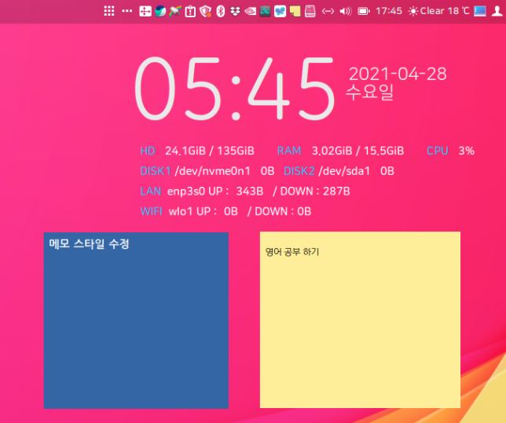

# xpad

Simple sticker memo provided by HamoniKR

메모별로 다양한 설정을 적용해서 사용할 수 있습니다.

 * HamoniKR, Ubuntu, LinuxMin 지원
 * 한글 설정 및 인터페이스 지원
 * upstream : https://launchpad.net/xpad
 


# Install

## Ubuntu, Debian, LinuxMint...
Open the terminal and enter the command below (Ctrl+Alt+T).

```
# Add Harmonica APT Storage
wget -qO- https://pkg.hamonikr.org/add-hamonikr.apt | sudo -E bash -


# Program installation
sudo apt install -y xpad

```

# Usage
 * 프로그램 설치 후 재시작 하면 시스템 트레이(패널)에 프로그램의 아이콘이 나옵니다. 

 * 트레이의 아이콘 위에서 마우스 오른쪽 버튼을 클릭하면 새 메모 추가 또는 설정 메뉴가 나옵니다.

<hr>

# 스티커 메모 프로그램 도움말

이 프로그램은 메모를 작성할 수있는 바탕 화면의 스티커 메모입니다. 

모든 메모는 자동으로 저장됩니다.

## 메모 이동하기

데스크탑에서 메모를 이동하는 방법에는 여러 가지가 있습니다.

텍스트 영역에서 [CTRL + 마우스 왼쪽 버튼 드래그]

[제목 표시 줄을 마우스 왼쪽 버튼으로 클릭]

[도구 모음에서 마우스 왼쪽 버튼 클릭]

## 메모 크기 조정하기

각 패드는 원하는 크기로 크기를 조정할 수 있습니다.

텍스트 영역에서 [CTRL + 마우스 오른쪽 버튼 드래그]

## 메모 보이기/숨기기

모든 메모를 표시하고 숨기는 몇 가지 방법이 있습니다.

[오른쪽 클릭 텍스트 영역]-[메모]–[모두 보이기]/[모두 닫기]

[트레이 아이콘 오른쪽 클릭]–[모두 보이기]/[모두 닫기]

## 메모 개별 설정

각각의 메모는 고유한 색상과 글꼴을 설정할 수 있습니다.

[텍스트 영역에서 마우스 오른쪽 버튼 클릭]-[속성]

패드에는 굵게, 기울임 꼴, 밑줄 및 취소 선과 같은 다양한 스타일이 포함될 수 있습니다.

[텍스트 선택]-[오른쪽 클릭]-이 텍스트에 대한 새 옵션이 나타납니다.

## 메모 단축키

CTRL-Q : 종료
CTRL-W : 현재 메모 닫기
CTRL-A : 모두 선택
CTRL-Z : 실행 취소
CTRL-Y : 다시 실행
CTRL-N : 새 메모
CTRL-B : 굵게
CTRL-I : 기울임 꼴
CTRL-U : 밑줄
SHIFT-DEL : 메모 삭제
