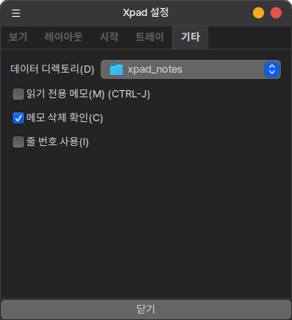

## xpad

Simple sticker memo provided by HamoniKR

데스크톱 에서 사용하는 포스트잇 메모 프로그램으로 메모별로 다양한 설정을 적용해서 사용할 수 있습니다.

 * upstream : https://launchpad.net/xpad
 


 * 데이터 디렉토리를 클라우드 폴더로 설정하면 `여러 컴퓨터에서 동기화`됩니다



## Install

## Ubuntu, Debian, LinuxMint...
Open the terminal and enter the command below (Ctrl+Alt+T).

```
# Add Harmonica APT Storage
wget -qO- https://pkg.hamonikr.org/add-hamonikr.apt | sudo -E bash -


# Program installation
sudo apt install -y xpad

```

## Usage
 * 프로그램 설치 후 재시작 하면 시스템 트레이(패널)에 프로그램의 아이콘이 나옵니다. 

 * 트레이의 아이콘 위에서 마우스 오른쪽 버튼을 클릭하면 새 메모 추가 또는 설정 메뉴가 나옵니다.


## Build from Source

If you want to compile and install xpad from source code, follow these steps:

### Prerequisites
Install the required dependencies:

```bash
# Ubuntu/Debian/LinuxMint
sudo apt update
sudo apt install -y build-essential autotools-dev automake autoconf libtool
sudo apt install -y libgtk-3-dev libglib2.0-dev intltool gettext pkg-config

# For older systems, you might need GTK2 instead:
# sudo apt install -y libgtk2.0-dev
```

### Compilation and Installation

1. Clone or download the source code
2. Navigate to the xpad directory
3. Run the following commands:

```bash
# Generate configure script (if building from git)
./autogen.sh

# Configure the build
./configure --prefix=/usr/local

# Compile the source code
make

# Install the program (requires root privileges)
sudo make install

# Update desktop database
sudo update-desktop-database
```

### Alternative Installation Prefix
If you want to install to a different location (e.g., `/usr`):

```bash
./configure --prefix=/usr
make
sudo make install
```

### Uninstall
To remove xpad installed from source:

```bash
sudo make uninstall
```
